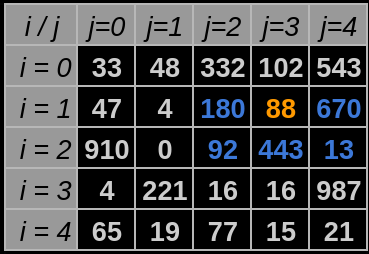

<!--Idea!! CITAR O NÍVIO ZIVIANI-->
<!--DÚVIDAS!!
    1. Pedir um feedback geral tanto do código quanto do readme.
    2. Perguntar se as minhas referências estão sendo realizadas da maneira correta.
    3. Tá grande de mais?
    remember the font: https://www.iconexperience.com/o_collection/search/?q=graph
-->

# O Algoritmo Guloso

#### Algoritmos e Estrutura de Dados

#### Compatibilidade e Desenvolvimento
 

  

## Introdução
Este repositório apresenta a solução implementada para um desafio da disciplina de Algoritmos e Estruturas de Dados. Há com isso o propósito de testar a implementação de um algoritmo guloso que faça pesquisa em uma matriz. Para melhor entendimento deste trabalho, considere as sentenças à seguir:
- $N$ - Ordem de uma matriz tal que $N \in \mathbb{Z}$ e $N\geq 0$.
- $i$ - Índice de uma linha que pertence à uma matriz específica, também pode ser abstraído como deslocamento na vertical, tal que $i \geq 0$ e $i \in \mathbb{Z}$.

- $j$ - Índice de uma coluna que pertence à uma matriz específica, também pode ser abstraído como deslocamento na horizontal, tal que $j \geq 0$ e $j \in \mathbb{Z}$.

- $a_{ij}$ - Elemento encontrado quando há deslocamento até a linha de índice $i$ e coluna de índice $j$. 

## Objetivo
A problemática proposta incita os alunos da disciplina a desenvolverem um programa que leia $K$ matrizes de ordem $N$. Considerando essa proposição algumas exigências de desenvolvimento solicitadas foram:

- As matrizes deverão estar préviamente organizadas para processamento.
- A pesquisa ou percorrimento na matriz iniciará à partir da entrada de dados do usuário ou de um arquivo. Esta entrada é o ponto de onde caminhada ou pesquisa pela matriz se inicia.

- Os movimentos válidos para deslocamento pela matriz são listados à seguir e visualizados de azul na Figura 1, considerando o ponto de partida atual sendo o elemento colorido de laranja:
    
    - Avançar para a próxima coluna, ou seja deslocar-se para $i = $ .
    
    - Retroceder a coluna anterior.
    
    - Avançar para a linha de baixo.
    
    - Avançar em diagonal esquerda, ou direita para baixo.

<strong>Figura 1</strong> - Movimentos possíveis    
 

 
Fonte: Construção pelo autor¹.
 
____________________________________________
 ¹Criada em planilha do Google Sheets, Disponível em <a href="https://docs.google.com/spreadsheets/d/1nbK5ybx7Lwp98y11IScqkPUhSizV1jwG1KyGsdvTEjI/edit?usp=sharing">Planilha</a>.

 

- Os movimentos devem ser realizados em direção às casas adjascentes de maior valor possível. No caso da Figura 1 essa opção representa o elemento em $i=1$ e $j=4$, portanto o próximo movimento se desloca até $a_{14}$.
- Caso haja um valor em comum entre as direções de maior valor, é  necessário que uma regra de caminhamento seja estabelecida. E que esta enquanto padrão seja a melhor decisão de caminhamento.
- Ao ter como posição atual o elemento de uma matriz posicionado na última linha e coluna simultâneamente, ou seja o elemento na coordenada de maior valor referente a $i$ e $j$, tais que, $i,j \in \mathbb{Z}$ onde $  0 \leq i\leq N$ e $0 \leq j \leq N$, considera-se que a matriz foi percorrida até o final com isso o programa recebe uma nova entrada referênte ao ponto inicial de caminhada para a próxima matriz. Caso o programa tenha lido a última matriz, isso não acontece.

<!--Prioridade alta-->
### Solução

### Imagens e exemplos de implementação:
//Usando uma matriz de exemplo com latex
$\begin{bmatrix}
1 & 0 & 0 & 0\\
0 & 2 & 0 & 0\\
0 & 0 & \ddots & 0\\
0 & 0 & 0 & n
\end{bmatrix}$

## Reflexões e Aprendizados

### O que é um Algoritmo Guloso?
"Um algoritmo guloso sempre faz a escolha que parece ser a melhor no momento em questão. 
Isto é, faz uma escolha localmente ótima, na esperança de que essa escolha leve a uma solução globalmente ótima." 
 
<strong>Algoritmos: teoria e prática, de Thomas H. Cormen, Charles E. Leiserson, Ronald L. Rivest e Clifford Stein, tradução da 3ª edição</strong>

### Reavaliando a Implementação de um Algoritmo Guloso
Com o intuito de preparar os alunos para a disciplina de Algoritmos e Estruturas de Dados dentro de um contexto onde os mesmos tivessem de ser avaliados em um período limitado de tempo, o desenvolvimento do desafio será avaliado diante da documentação e tentativa de construir um algoritmo guloso que resolvesse o problema apresentado.

Contudo, é importante ressaltar que a implementação de algoritmos gulosos necessita de um estudo aprofundado em outros cenários antes de ser implementado.

Considerando isso, são propostos por Cormen(2012) os Elementos da Estratégia Gulosa, ou seja, a projeção de algoritmos gulosos conta com a seguinte sequência de etapas:

1. "Projetar o problema [...] como um problema no qual fazemos uma escolha e ficamos com um único subproblema para resolver"(CORMEN, 2012, p.354).  
2. "Provar que sempre existe uma solução ótima para o problema original que usa a escolha gulosa, de modo que a escolha gulosa é sempre segura"(CORMEN, 2012, p.354)."  
3. "Demonstrar subestrutura ótima, mostrando que, tendo feito a escolha gulosa, o que resta é o subproblema com a seguinte propriedade: se combinamos uma solução ótima para o subproblema com a escolha que fizemos, chegamos a uma solução ótima para o problema original"(CORMEN, 2012, p.354).  

<!--Prioridade baixa-->## Bibliotecas

## Compilação e Execução
Para compilação e execução do código é necessário que seja criado um arquivo Makefile. Para uso deste arquivo da forma correta, siga as diretrizes de execução abaixo:

<table>

<tr>
<td colspan = '1'><strong>Comandos</strong></td>
<td align = "center" colspan = '1'><strong>Funções</strong></td>
</tr>

<tr>
<td align="center">make clean</td>
<td align="center">Deleta o arquivo executável e todos os arquivos objetos do diretório. (GNU make, 2023)</td>
</tr>
<tr>
<td align="center">make</td>
<td align="center">Compila diferentes partes do programa através do g++ e cria um arquivo executável na pasta build. </td>
</tr>
<tr>
<td align="center">make run </td>
<td align="center">Executa o programa da pasta build após a realização da compilação. (Michel Pires, 2023)</td>
</tr>
</table>

## Referências <!--Idea!! CITAR O NÍVIO ZIVIANI-->

[1] CORMEN, T. H. et al. Introduction to Algorithms, third edition. [s.l.] MIT Press, 2009. Acessador em 20 de Março de 2023.

[2] Michel Pires - Repositório GitHub, @mpiress: GenerateDataToMatrix - Disponível em: https://github.com/mpiress/GenerateDataToMatrix/blob/main/src/mat.h. Acessado em 15 de Março de 2023.

[3] GNU make. Disponível em: <https://www.gnu.org/software/make/manual/make.html>. Acessado em 21 de Março de 2023.

‌
## Contato

 

<a style="color:black" href="mailto:michel@cefetmg.br?subject=[GitHub]%20Source%20Dynamic%20Lists">
✉️ <i>joaogu.2001@gmail.com</i>
</a>

